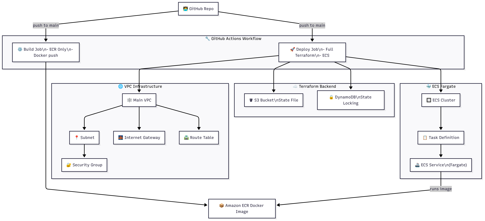

## Architecture Diagram

Here is the AWS Infrastructure and CI/CD Diagram:

DevOps Learn in 30 – AWS Infrastructure & CI/CD Project
Project Overview
This project demonstrates a comprehensive AWS-based DevOps pipeline designed to teach and implement modern infrastructure and continuous integration/continuous deployment (CI/CD) principles. It integrates source control, automated build and deployment pipelines, infrastructure as code, container orchestration, and AWS managed services to provide a robust, scalable, and secure environment for deploying containerized applications.

The project is intended as a hands-on learning experience for developers and DevOps engineers seeking to understand how AWS infrastructure and DevOps tools can be combined to automate software delivery and infrastructure management.

Key Objectives
Automate the build and deployment of containerized applications using AWS native tools.

Use infrastructure as code (IaC) to provision and manage AWS resources reliably.

Implement a scalable, secure networking environment for containerized workloads.

Maintain consistent and safe Terraform state management to enable collaborative infrastructure changes.

Leverage AWS managed CI/CD services to streamline software delivery.

Provide a clear example of how source control triggers deployment workflows.

Core Components & Architecture
1. Source Control & Trigger Mechanism
GitHub Repository
Acts as the centralized source of truth for the application code and infrastructure definitions. All changes pushed to the main branch initiate the CI/CD pipeline automatically, ensuring continuous integration.

2. Continuous Integration Workflow
AWS CodeBuild (Build Job)
This service is configured to:

Build Docker container images from the application source code.

Push the built Docker images to Amazon Elastic Container Registry (ECR), a fully managed container registry service on AWS.

By automating image builds on every code change, the project ensures that the latest application versions are always available for deployment.

3. Continuous Deployment Workflow
AWS CodePipeline (Deploy Job)
Orchestrates the deployment process by:

Running Terraform scripts to provision or update the necessary AWS infrastructure components, ensuring that the environment is correctly set up and consistent.

Deploying the containerized application on AWS Elastic Container Service (ECS) with Fargate launch type, which allows running containers without managing servers or clusters.

This pipeline automates both infrastructure changes and application updates, enabling fast and reliable releases.

4. Infrastructure as Code (Terraform)
Terraform is used to declare and manage all AWS resources including networking, compute, storage, and container services.

Terraform Backend Configuration:

S3 Bucket: Stores the Terraform state files, which represent the current state of deployed infrastructure.

DynamoDB Table: Provides state locking and consistency, preventing multiple users from making concurrent conflicting changes to infrastructure.

This setup promotes collaboration and safe infrastructure management.

5. Networking & Security
Amazon Virtual Private Cloud (VPC):
Provides an isolated and secure network environment for all deployed resources.

Subnets:
Logical subdivisions of the VPC to organize and isolate resources.

Security Groups:
Act as virtual firewalls controlling inbound and outbound traffic to resources.

Internet Gateway & Route Tables:
Manage connectivity between the VPC and the internet, routing external traffic securely to and from resources that require it.

This network design ensures a secure and manageable environment for running production workloads.

6. Container Orchestration
Amazon ECS with Fargate:
ECS manages container scheduling and orchestration.

ECS Cluster: Logical grouping of ECS services and tasks.

Task Definition: Defines container details such as Docker image, CPU, memory, ports, and environment variables.

ECS Service: Ensures that the specified number of tasks are running and manages deployment and scaling.

Fargate launch type abstracts away server and cluster management, enabling focus on application logic.

7. Container Image Storage
Amazon Elastic Container Registry (ECR):
Securely stores Docker images built by the CodeBuild process and serves them to ECS during deployment.

Workflow Summary
Code Push: Developer pushes code changes to the main branch of the GitHub repository.

Build Process: GitHub Actions or AWS CodeBuild triggers automatically to build the Docker image and push it to ECR.

Infrastructure Provisioning: AWS CodePipeline triggers Terraform scripts to provision or update AWS infrastructure (network, compute, storage, etc.).

Deployment: ECS service updates or launches the new containerized application using the Docker image stored in ECR.

State Management: Terraform state is securely stored in S3 with locking ensured by DynamoDB to coordinate team changes.

Benefits of this Project
Automation: Reduces manual intervention in building, testing, and deploying applications.

Scalability: Uses managed AWS services that automatically scale based on demand.

Reliability: Infrastructure as code ensures consistent, repeatable deployments.

Security: Network segmentation and secure image registries protect workloads.

Collaboration: Shared Terraform state management supports multiple operators working concurrently.

Learning Value: Provides a clear example of best practices integrating DevOps and AWS.

Prerequisites
AWS Account with permissions to manage: ECS, ECR, VPC, S3, DynamoDB, CodeBuild, CodePipeline.

Terraform installed and configured.

Docker knowledge for containerization.

GitHub repository for source control.

Familiarity with AWS CLI and IAM roles/policies.

